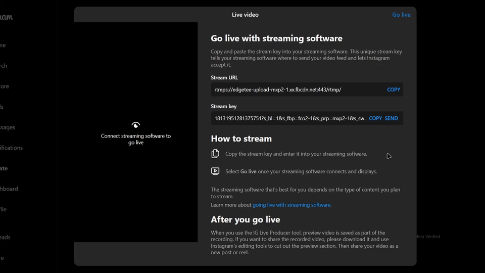

<h1 align="center">
   
  
   
  Keygram
   
</h1>

<h3 align="center">A browser extension to automatically send your Instagram streamkey to a multistreaming server.</h3>

<!--

  <a href="#what-it-does">What it Does</a> •
  <a href="#how-to-install">How to Install</a> •
  <a href="#support-this-project">Donations</a> 

-->

  

## What it Does

This browser extension enhances the Instagram streaming setup by adding a button to the streamkey input box. Once clicked, it sends the one-time use streamkey to a user-configured streaming server. The server automatically processes the key to route the stream from the server to Instagram. The extension includes a settings panel where users can configure the destination streaming server and optionally provide an authentication password for added security.

<a href="server.md">Server Setup Guide (Linux)</a>

## How to Install

-   Download the extension from the <a href="https://github.com/itzsmoki/Keygram/releases">Releases</a> section of the repository.
-   Go to chrome://extensions in your Chrome browser.
-   Enable **Developer mode** in the top right.
-   Click **Load unpacked**.
-   Select the folder of the downloaded extension.
-   The extension will now be installed and ready to use!

## Support This Project!

This is a small project I created to learn and improve my skills. Your donations will help me enhance it further by adding advanced features and integrated services. Any support, big or small, is greatly appreciated and will contribute to making this tool better with each update.

